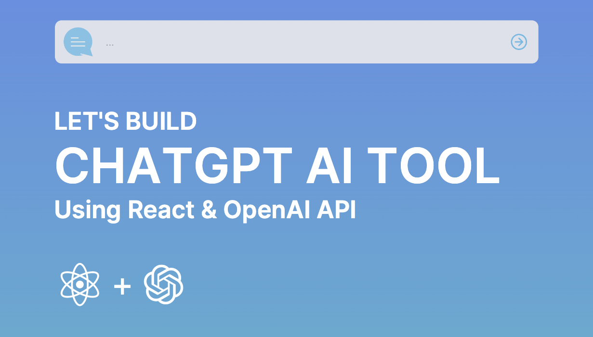

# Develop-ChatGPT-AI-Tool-Using-React-JS

Develop ChatGPT AI Tool using React JS, and Tailwind CSS.

## How to Install ?
- Download / Clone the project in to your local host
- Make sure your using latest version of node
- Run `npm install` in the root folder
- Rename the `env.example` file in to `.env`
- Upadate your `OpenAI API key` in to the `.env` file.
- How to create `OpenAI API Key`? you can able to refer from the following link https://www.youtube.com/watch?v=swcXTgvjHSA
- Run `npm run start` will run the  app in the development mode.
- Run `npm run server` will run the  dev server.

## Available Scripts

In the project directory, you can run:

### `npm start`
Runs the app in the development mode.\

### `npm run build`
Builds the app for production to the `build` folder.\

### `npm run server`
Runs the node server. default port is 9008.\ 
